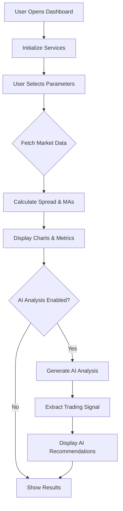

# Murban Intelligence Copilot
## Business-Friendly Technical Overview

---

## 1. Executive Summary

### What the System Does
The **Murban Intelligence Copilot** is an AI-powered trading analysis application that provides real-time insights into the WTI-Brent crude oil spread. It combines live market data with artificial intelligence to generate actionable trading signals for energy traders and analysts.

### Business Problem It Solves
Energy traders need to monitor the price differential between WTI (West Texas Intermediate) and Brent crude oil—two of the world's most important oil benchmarks. Tracking this spread manually requires:
- Constant monitoring of multiple data sources
- Complex technical analysis calculations
- Interpretation of market trends

This system **automates the entire workflow**, providing instant analysis and AI-generated trading recommendations with confidence scores.

### Who Uses It and How It Creates Value

| User Type | Value Delivered |
|-----------|-----------------|
| **Crude Oil Traders** | Real-time spread analysis with buy/sell signals |
| **Portfolio Managers** | Quick market sentiment assessment |
| **Energy Analysts** | Automated technical analysis and trend detection |
| **Risk Managers** | Early warning indicators for spread movements |

### LLM Technology Used
The system uses a **flexible dual-model architecture** with configurable backends:

| Stage | Default Model | Backend | Purpose |
|-------|---------------|---------|---------|
| **Analysis** | Gemma-3-12B-IT | llama-cpp-python | Comprehensive market analysis |
| **Extraction** | DistilRoBERTa (financial) | HuggingFace Transformers | Sentiment classification |

**Key Benefits:**
- Models run locally (no cloud API calls) — **data privacy** and **zero per-query costs**
- Configurable model switching via YAML — swap models without code changes
- Domain-specific extraction — DistilRoBERTa fine-tuned on financial text for better accuracy

---

## 2. High-Level System Architecture

```
┌─────────────────────────────────────────────────────────────────┐
│                        USER INTERFACE                            │
│                    (Streamlit Dashboard)                         │
│    ┌──────────┐  ┌──────────┐  ┌──────────┐  ┌──────────┐      │
│    │ Controls │  │  Charts  │  │  Tables  │  │ AI Card  │      │
│    └──────────┘  └──────────┘  └──────────┘  └──────────┘      │
└─────────────────────────────────────────────────────────────────┘
                              │
                              ▼
┌─────────────────────────────────────────────────────────────────┐
│                     APPLICATION LAYER                            │
│              (Use Cases / Business Orchestration)                │
│    ┌──────────────┐  ┌────────────────┐  ┌─────────────────┐   │
│    │ Fetch Market │  │ Analyze Spread │  │ Generate Signal │   │
│    │    Data      │  │                │  │     (AI)        │   │
│    └──────────────┘  └────────────────┘  └─────────────────┘   │
└─────────────────────────────────────────────────────────────────┘
                              │
        ┌─────────────────────┼─────────────────────┐
        ▼                     ▼                     ▼
┌───────────────┐    ┌───────────────┐    ┌───────────────┐
│  MARKET DATA  │    │  LLM ENGINE   │    │   ANALYTICS   │
│    SERVICE    │    │               │    │    ENGINE     │
│               │    │ ┌───────────┐ │    │               │
│  Yahoo Finance│    │ │ Analysis  │ │    │ Spread Calc   │
│  (WTI, Brent) │    │ │  Model    │ │    │ Moving Avg    │
│               │    │ └───────────┘ │    │ Trend Detect  │
│               │    │ ┌───────────┐ │    │               │
│               │    │ │Extraction │ │    │               │
│               │    │ │  Model    │ │    │               │
│               │    │ └───────────┘ │    │               │
└───────────────┘    └───────────────┘    └───────────────┘
        │                     │                     │
        └─────────────────────┴─────────────────────┘
                              │
                              ▼
                    ┌───────────────┐
                    │  PERSISTENCE  │
                    │ • LLM Cache   │
                    │ • Logs        │
                    │ • Config      │
                    └───────────────┘
```

### Component Overview

| Component | Purpose | Technology |
|-----------|---------|------------|
| **User Interface** | Interactive dashboard for visualization and control | Streamlit, Plotly |
| **Application Layer** | Orchestrates business workflows | Python use cases |
| **Market Data Service** | Fetches real-time crude oil prices | Yahoo Finance API |
| **LLM Engine** | Generates AI-powered analysis and signals | llama-cpp-python + HuggingFace Transformers |
| **Model Factory** | Creates appropriate client based on config | Python factory pattern |
| **Analytics Engine** | Calculates spreads, moving averages, trends | NumPy, custom algorithms |
| **Persistence** | Caches responses, stores logs | File-based JSON cache |

---

## 3. End-to-End Data & Request Flow

### User Request Lifecycle



### Detailed Flow Steps

1. **User Opens Dashboard**
   - Streamlit application launches
   - Configuration loaded from YAML file
   - Services initialized (market client, LLM clients, calculators)

2. **User Selects Parameters**
   - Historical days slider (7-90 days)
   - AI analysis toggle (on/off)
   - Manual refresh option

3. **Data Fetching**
   - System queries Yahoo Finance for WTI (`CL=F`) and Brent (`BZ=F`) prices
   - Automatic retry with exponential backoff on failures
   - Fallback to sample data if service unavailable

4. **Spread Calculation**
   - Spread = WTI Price - Brent Price
   - 5-day moving average (short-term trend)
   - 20-day moving average (long-term trend)
   - Trend signal based on MA crossover

5. **Visualization**
   - Interactive Plotly chart with price lines and spread
   - Metric cards showing current values
   - Data tables with CSV download option

6. **AI Analysis (if enabled)**
   - Market data formatted into analysis prompt
   - Analysis model generates comprehensive trading brief
   - Extraction model parses signal from analysis
   - Signal card displays recommendation with confidence

---

## 4. Prompting & Orchestration Logic

### Dual-Model Pipeline

The system uses a **two-stage AI pipeline** with configurable model backends:

```
                    ┌─────────────────────────┐
    Market Data ───▶│   ANALYSIS MODEL        │
                    │   (Gemma-3-12B)         │
                    │   Backend: llama-cpp    │
                    │                         │
                    │ • Comprehensive review  │
                    │ • Technical analysis    │
                    │ • Fundamental factors   │
                    │ • Risk assessment       │
                    └───────────┬─────────────┘
                                │
                    Full Analysis Text
                                │
                                ▼
                    ┌─────────────────────────┐
                    │   EXTRACTION MODEL      │
                    │   (DistilRoBERTa)       │
                    │   Backend: transformers │
                    │                         │
                    │ • Signal: bullish/      │
                    │   bearish/neutral       │
                    │ • Confidence: 0.0-1.0   │
                    └───────────┬─────────────┘
                                │
                    Structured Signal
                                │
                                ▼
                    ┌─────────────────────────┐
                    │   USER DISPLAY          │
                    │   Signal Card           │
                    └─────────────────────────┘
```

### Configurable Model Backends

The system supports two model backends that can be mixed and matched:

| Backend | Type | Best For | Configuration |
|---------|------|----------|---------------|
| `llama` | llama-cpp-python | Text generation with GGUF models | `model_type: "llama"` |
| `transformers` | HuggingFace | Sentiment classification | `model_type: "transformers"` |

### Default Model Configuration

| Stage | Model | Backend | Purpose |
|-------|-------|---------|---------|
| **Analysis** | Gemma-3-12B-IT | llama | Creative market analysis (temp: 0.7) |
| **Extraction** | DistilRoBERTa | transformers | Financial sentiment classification |

### Why This Architecture?

This separation provides key advantages:
- **Optimized for task**: Large generative model for analysis, specialized classifier for signals
- **Domain expertise**: DistilRoBERTa fine-tuned on financial news for better sentiment accuracy
- **Flexibility**: Swap models via configuration without code changes
- **Cost efficiency**: Smaller extraction model (~66M params) reduces compute requirements

### Prompt Templates

**System Prompt (Analyst Persona):**
> "You are a Senior Quantitative Strategist crude oil trader providing market analysis. Your style is professional but accessible, using common trading terminology. Provide concise, actionable insights based on the data provided."

**Analysis Template Sections:**
1. Market Overview
2. Technical Analysis (MA crossovers, momentum)
3. Fundamental Drivers (macro factors, supply/demand)
4. Risk Assessment
5. Trading Implications
6. Strategic Considerations

**Extraction Format:**
```
SIGNAL: [bullish/bearish/neutral]
CONFIDENCE: [0.0-1.0]
SUMMARY: [One sentence summary]
```

### Fallback Logic
If the extraction model fails to return the expected format:
- System uses keyword matching (bullish/bearish indicators)
- Falls back to "neutral" signal with 50% confidence
- Ensures users always receive a response

---

## 5. Retrieval / Knowledge Integration

### Current Implementation
This system does **not** use retrieval-augmented generation (RAG). Instead, it operates on:
- **Real-time data**: Fresh market prices from Yahoo Finance
- **Calculated context**: Spread values, moving averages, trend indicators

### Data Sources

| Source | Data Provided | Update Frequency |
|--------|--------------|------------------|
| Yahoo Finance | WTI, Brent prices (OHLCV) | Real-time during market hours |
| Internal Calculator | Spread, MAs, trend signals | On-demand per analysis |
| Historical Cache | Past LLM responses | Persistent file storage |

### Future RAG Opportunities
The architecture could be extended to include:
- Market news articles for context
- Historical trading patterns
- Analyst reports and sentiment data

---

## 6. Model Overview

### Model Backend Options

The system supports two model backends, configurable per stage:

| Backend | Library | Model Format | Best For |
|---------|---------|--------------|----------|
| **llama** | llama-cpp-python | GGUF (quantized) | Text generation, analysis |
| **transformers** | HuggingFace Transformers | PyTorch | Classification, sentiment |

### Analysis Model: Gemma-3-12B-IT (Default)

| Property | Value |
|----------|-------|
| **Model Type** | Instruction-tuned transformer |
| **Backend** | llama (llama-cpp-python) |
| **Parameters** | 12 billion |
| **Quantization** | Q6_K (6-bit, high quality) |
| **Source** | HuggingFace (MaziyarPanahi) |
| **Context Window** | 4,096 tokens |
| **Capabilities** | Market analysis, technical writing, reasoning |
| **Limitations** | Cannot access live data; relies on provided context |

### Extraction Model: DistilRoBERTa (Default)

| Property | Value |
|----------|-------|
| **Model Type** | Fine-tuned DistilRoBERTa for financial sentiment |
| **Backend** | transformers (HuggingFace) |
| **Parameters** | ~66 million |
| **Training Data** | Financial news articles |
| **Task** | Sentiment classification |
| **Output** | positive/negative/neutral → bullish/bearish/neutral |
| **Capabilities** | Domain-specific financial sentiment detection |
| **Limitations** | Classification only; no text generation |

### Alternative Extraction Models

| Model | Parameters | Description |
|-------|------------|-------------|
| `ProsusAI/finbert` | ~110M | Financial sentiment (BERT-based) |
| `yiyanghkust/finbert-tone` | ~110M | Financial tone analysis |
| `bartowski/gemma-2-9b-it-GGUF` | 9B | Generative extraction (llama backend) |

### Why This Model Combination?

| Benefit | Description |
|---------|-------------|
| **Domain Expertise** | DistilRoBERTa fine-tuned specifically on financial news |
| **Accuracy** | Sentiment classifiers outperform prompted LLMs for this task |
| **Efficiency** | 66M params vs 12B for extraction — faster, lower cost |
| **Privacy** | All models run locally, no external API calls |
| **Flexibility** | Switch models via config without code changes |

---

## 7. Safety, Guardrails & Validation

### Input Validation
- **Date Range**: Limited to 7-90 days of historical data
- **Data Quality**: Validates price data is non-empty and numeric
- **Date Alignment**: Ensures WTI and Brent data have matching dates

### Output Filtering
- **Signal Validation**: Only accepts "bullish", "bearish", or "neutral"
- **Confidence Bounds**: Clamped to 0.0-1.0 range
- **Fallback Defaults**: Safe neutral signal if parsing fails

### Business Rules
- **Financial Disclaimer**: Every AI signal includes a legal disclaimer:
  > "This analysis is for informational purposes only and does not constitute financial advice. Past performance is not indicative of future results."
- **Confidence Transparency**: Users see the model's confidence level
- **Analysis Attribution**: Full LLM output shown for transparency

### Safeguards Against Errors
- **Graceful Degradation**: Falls back to sample data if market API fails
- **Retry Logic**: Automatic retries with exponential backoff
- **Health Monitoring**: Dashboard shows component status
- **Error Logging**: All errors captured for debugging

---

## 8. Monitoring & Performance

### System Health Dashboard

The sidebar displays real-time health status:

| Component | Status Indicators |
|-----------|------------------|
| **Market Data** | ✅ Healthy / ⚠️ Degraded / ❌ Unavailable |
| **Analysis LLM** | ✅ Available / ❌ Not Loaded |
| **Extraction LLM** | ✅ Available / ❌ Not Loaded |

### Performance Tracking

| Metric | How Tracked |
|--------|-------------|
| **API Latency** | Health checker measures response time |
| **LLM Response Time** | Logged per generation |
| **Cache Hit Rate** | Cached vs. generated responses |
| **Error Rate** | Exception logging and counts |

### Logging Infrastructure
- **Location**: `logs/` directory
- **Rotation**: 10 MB max file size, 5 backup files
- **Format**: Structured text with timestamps
- **Levels**: DEBUG, INFO, WARNING, ERROR

### Caching Strategy
- **LLM Cache**: SHA256-hashed prompts stored as JSON
- **Cache Benefits**:
  - Instant responses for repeated queries
  - Reduced GPU utilization
  - Consistent outputs for same inputs

---

## 9. Assumptions, Constraints & Limitations

### Data Limitations
| Limitation | Impact | Mitigation |
|------------|--------|------------|
| Yahoo Finance dependency | System relies on third-party API availability | Retry logic, sample data fallback |
| Market hours only | No real-time data outside trading hours | Uses most recent available data |
| 90-day maximum history | Limited historical analysis | Configurable, can be extended |

### Model Constraints
| Constraint | Description |
|------------|-------------|
| **Context Window** | 4,096 tokens limits analysis depth |
| **No Real-Time Knowledge** | Models trained on historical data only |
| **Hallucination Risk** | LLMs may generate plausible but incorrect analysis |
| **Quantization Trade-offs** | Smaller model files may reduce accuracy slightly |

### Known Risks

| Risk | Likelihood | Impact | Mitigation |
|------|------------|--------|------------|
| **Hallucinations** | Medium | Incorrect trading signal | Confidence scores, dual-model validation |
| **API Outage** | Low | No fresh data | Fallback to cached/sample data |
| **GPU Memory** | Low | Model fails to load | Configurable GPU layers |
| **Stale Cache** | Medium | Outdated recommendations | Cache invalidation strategies |

### Operational Constraints
- **GPU Recommended**: CPU-only inference is significantly slower
- **Memory Requirements**: 8GB+ RAM for model loading
- **Disk Space**: ~10GB for model files

---

## 10. Opportunities for Improvement

### Better Prompting
| Opportunity | Benefit | Effort |
|-------------|---------|--------|
| Add few-shot examples | More consistent output format | Low |
| Include historical patterns | Richer analysis context | Medium |
| Dynamic prompt selection | Adapt to market conditions | Medium |

### Improved Analysis Quality
| Opportunity | Benefit | Effort | Status |
|-------------|---------|--------|--------|
| RAG with market news | Real-time context awareness | High | Planned |
| ~~Sentiment analysis integration~~ | ~~Multi-source signals~~ | ~~Medium~~ | **Implemented** (DistilRoBERTa) |
| Technical indicator library | More sophisticated analysis | Medium | Planned |

### Model Upgrades
| Opportunity | Benefit | Effort | Status |
|-------------|---------|--------|--------|
| Larger analysis model | Deeper reasoning capability | Low | Planned |
| ~~Fine-tuned extraction model~~ | ~~Better signal accuracy~~ | ~~High~~ | **Implemented** (DistilRoBERTa) |
| Ensemble approach | More robust predictions | High | Planned |

### Scalability & Reliability
| Opportunity | Benefit | Effort |
|-------------|---------|--------|
| Redis caching | Faster distributed cache | Medium |
| Multiple data sources | Reduced single-point failure | Medium |
| Model serving infrastructure | Production-grade deployment | High |

### Business Impact Expansion
| Opportunity | Benefit | Effort |
|-------------|---------|--------|
| Additional commodity spreads | Broader market coverage | Low |
| Alert/notification system | Proactive user engagement | Medium |
| Backtesting framework | Signal validation | High |
| API endpoint exposure | Integration with trading systems | Medium |

---

## Appendix A: Glossary

| Term | Definition |
|------|------------|
| **WTI** | West Texas Intermediate; U.S. benchmark crude oil |
| **Brent** | North Sea benchmark crude oil |
| **Spread** | Price difference between two assets (WTI - Brent) |
| **Moving Average (MA)** | Average price over a period; smooths volatility |
| **MA Crossover** | When short-term MA crosses long-term MA; trend signal |
| **LLM** | Large Language Model; AI for text generation |
| **GGUF** | Model file format for llama.cpp inference |
| **Quantization** | Model compression technique (Q4, Q6, etc.) |
| **RAG** | Retrieval-Augmented Generation; combining search with LLM |
| **FinBERT** | BERT model fine-tuned on financial text for sentiment analysis |
| **DistilRoBERTa** | Distilled RoBERTa model, smaller and faster than BERT |
| **Transformers** | HuggingFace library for pre-trained NLP models |
| **Sentiment Classification** | Categorizing text as positive, negative, or neutral |

---

## Appendix B: Configuration Reference

### Key Configuration Parameters

```yaml
# config/llm_config.yaml

llm:
  defaults:
    n_ctx: 4096
    n_gpu_layers: -1
    verbose: false

  # Analysis model (text generation)
  analysis:
    model_type: "llama"  # Options: "llama" | "transformers"
    model_repo: "MaziyarPanahi/gemma-3-12b-it-GGUF"
    model_file: "gemma-3-12b-it.Q6_K.gguf"
    inference:
      temperature: 0.7
      max_tokens: 2048
      top_p: 0.9
      top_k: 50
      frequency_penalty: 0.3
      presence_penalty: 0.1

  # Extraction model (sentiment classification)
  extraction:
    model_type: "transformers"  # Use HuggingFace model
    model_repo: "mrm8488/distilroberta-finetuned-financial-news-sentiment-analysis"
    task: "sentiment-analysis"
    device: "cpu"  # Options: "auto" | "cpu" | "cuda" | "mps"
    inference:
      temperature: 0.1
      max_tokens: 150

market_data:
  wti_ticker: "CL=F"
  brent_ticker: "BZ=F"
  timeout: 60

analysis:
  short_ma_window: 5
  long_ma_window: 20

ui:
  min_historical_days: 7
  max_historical_days: 90
```

---

## Appendix C: Deployment Options

### Local Development
```bash
conda activate murban-copilot
streamlit run src/murban_copilot/interface/streamlit_app.py
```

### Docker Deployment
```bash
docker-compose up -d
# Access at http://localhost:8501
```

### Production Considerations
- GPU-enabled container runtime (NVIDIA Docker)
- Persistent volumes for cache and logs
- Health check monitoring
- Log aggregation integration

---

*Document generated for Murban Intelligence Copilot v1.0*
*Last updated: February 2026*
